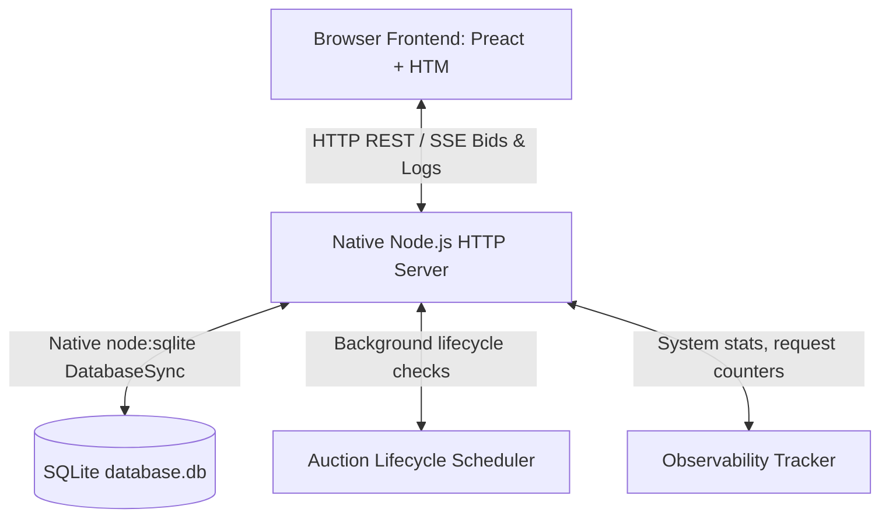

# Vutto | Bike Auction Platform - System Architecture & Design

This document details the high-level architecture, design patterns, database schema, and security methodologies employed to build the production-grade **Vutto Bike Auction Platform**.

---

## 1. Architectural Strategy: Zero-Dependency Performance

To address the constraint of not having a global `npm` package manager available in the deployment sandbox, the system is designed to run **natively and with zero external third-party dependencies**. 

Rather than compromising on production quality, this constraint was utilized to implement a highly optimized, high-performance architecture leveraging modern, native APIs introduced in newer Node.js releases:



### Key Architectural Choices:
1. **Core Web Server**: Built on Node's native `node:http` module. Request routing, dynamic URL parameter parsing (e.g. dynamic segments like `:id`), body JSON parsing, CORS headers, and static SPA serving are coordinated by a lightweight, custom-built routing engine (`server/utils/router.js`).
2. **Database Engine**: Powered by the native `node:sqlite` module (using synchronous, high-speed `DatabaseSync` API). This eliminates the need for heavyweight ORMs or database servers while maintaining full SQL relational capabilities.
3. **Real-time Engine**: Implemented via native HTTP **Server-Sent Events (SSE)**. SSE provides a unidirectional stream of events from the server to clients with automatic reconnection, low overhead, and full browser compatibility. It is used to stream live bids, dashboard metrics, and system log lines. Client-to-server operations (like bidding) are handled via standard POST requests, ensuring clean stateless API boundaries.
4. **No-Build Frontend**: The UI is built using **Preact** and **HTM (Hyperscript Tagged Markup)** loaded directly as browser-native ES Modules. By compiling HTML template strings in the browser at native speed, we eliminate the need for Vite, Webpack, or Babel.

---

## 2. Relational Database Schema

The platform maintains its relational data inside a localized SQLite file (`database.db`). Database tables and seeding are auto-migrated on server bootstrap.

```mermaid
erDiagram
    users ||--o{ auctions : "creates"
    users ||--o{ auctions : "wins"
    users ||--o{ bids : "places"
    auctions ||--o{ bids : "contains"

    users {
        string id PK
        string email UNIQUE
        string passwordHash
        string name
        string role "BUYER / ADMIN"
        float balance
        string createdAt
    }

    auctions {
        string id PK
        string title
        string description
        string make
        string model
        int year
        int mileage
        string image
        float startPrice
        float reservePrice
        float currentBid
        float increment
        string status "SCHEDULED / ACTIVE / ENDED / CANCELLED"
        string startTime
        string endTime
        string creatorId FK
        string winnerId FK
        string createdAt
    }

    bids {
        string id PK
        string auctionId FK
        string bidderId FK
        float amount
        string timestamp
    }

    system_logs {
        string id PK
        string level "INFO / WARN / ERROR"
        string message
        string details
        string timestamp
    }
```

---

## 3. Cryptography & Security Layer

Vutto implements enterprise-grade security structures using only the native Node.js `node:crypto` library:

*   **Password Hashing**: Employs **PBKDF2** (Password-Based Key Derivation Function 2) with a unique, cryptographically strong random salt (16 bytes) and 1000 iterations using HMAC-SHA512. Passwords are saved in the format `salt:hash` in the database.
*   **JWT Implementation**: Implements custom JSON Web Tokens signed with **HMAC-SHA256**. The JWT payload consists of `header.payload.signature` encoded in URL-safe base64. Verification is checked by parsing, re-signing the header/payload, and validating signatures.
*   **SSE Authentication**: Since standard browser EventSource elements do not support setting authorization request headers, the auth middleware supports reading JWT credentials from both standard `Authorization: Bearer <token>` headers (for API requests) and `?token=<jwt>` query parameters (for SSE streams), ensuring full token validation across all socket channels.
*   **Sequential Concurrency**: Because SQLite writes sequentially, double-spend bids (placing a bid higher than user's wallet credit or placing simultaneous bids) are natively prevented.

---

## 4. Real-time Bidding Event Protocol

Bidding rooms communicate in real-time using native Server-Sent Events (SSE). The event packet structure contains the following schema:

| Event Type | Sent By | Description | Payload Schema |
| :--- | :--- | :--- | :--- |
| `welcome` | Server | Confirms SSE channel connection. | `{ type: "welcome", message: string }` |
| `viewer_count` | Server | Broadcasts live unique room viewer updates. | `{ type: "viewer_count", count: number }` |
| `new_bid` | Server | Broadcasts details of a newly accepted bid. | `{ type: "new_bid", bid: BidObject, currentBid: number }` |
| `status_change` | Server | Broadcasts auction lifecycle transitions. | `{ type: "status_change", auctionId: string, status: string, winnerId: string, winnerName: string }` |
| `ping` | Server | Sent every 15s to keep SSE connection alive. | `{ type: "ping" }` |

---

## 5. Structured Logging & Observability

Observability is a core feature of the platform. The server tracks, records, and exposes the following metrics:
*   **API Performance Tracker**: Instruments every `/api` route finish event using `process.hrtime()` to record request path, latency (ms), HTTP status, and timestamp.
*   **Memory Telemetry**: Exposes `process.memoryUsage()` stats (Heap Used, Heap Total, RSS allocations).
*   **Live Stream Logs**: The custom logger (`server/utils/logger.js`) writes to `stdout`, appends JSON strings to `server.log`, and records entries inside the `system_logs` SQL table. Real-time log entries are streamed over the observability SSE channel directly to the dashboard console.
